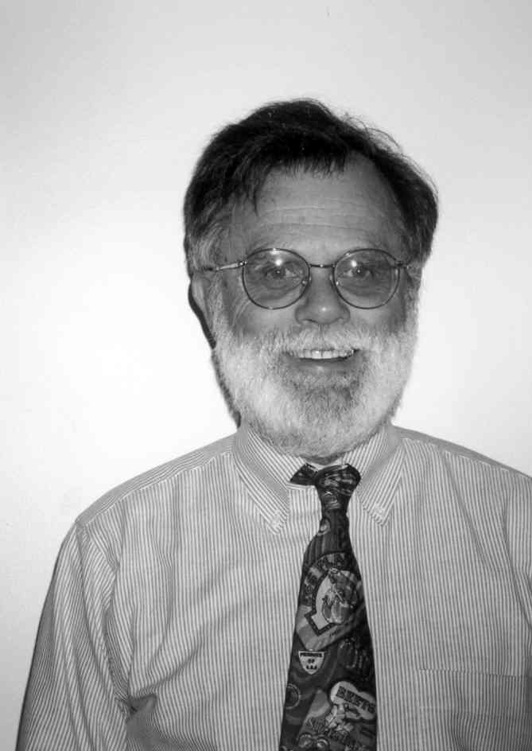
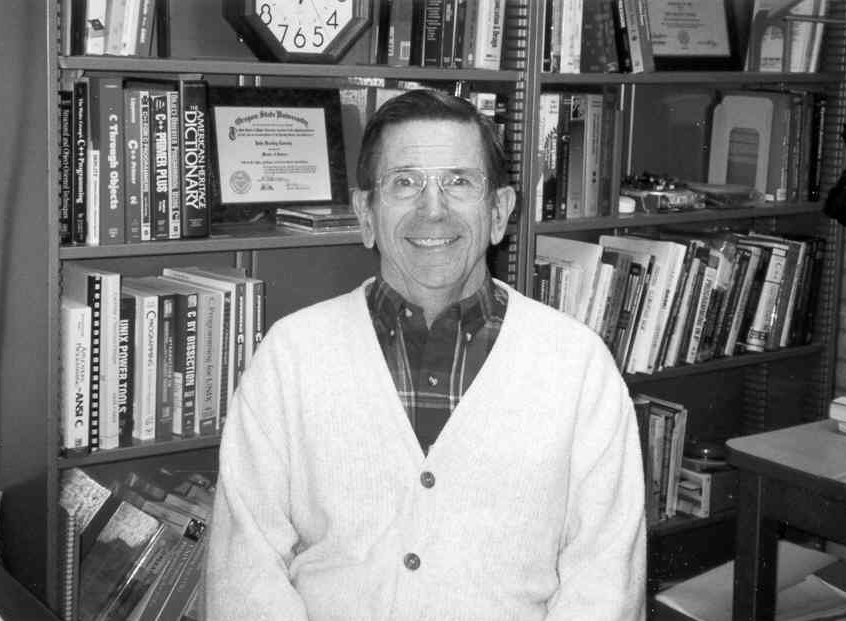

1990-1993 Department Chair-Patrick Wheatley
===========================================

Introduction
------------

The new chairman of Cal Poly’s computer science department hopes to
bring empathy and understanding to an area of academia traditionally
associated with otherwise unemotional machines.[^16] Professor Patrick
Wheatley, a 20-year faculty member is beginning his three-year term
after being appointed by Dean of Engineering, Peter Y. Lee.

Wheatley said that he wants to use a people-oriented approach to his
position. “I feel that I’m a people person,” said Wheatley. “What I want
to do is to help students and faculty achieve their goals and be happy
with their work.” Wheatley said that he’s well suited to the task
because he feels no conflict between either the administration, the
faculty or the students. “I will represent the faculty and students to
the administration and explore each case individually and with
consideration rather than be completely bound by policy.”

“I must be fair and understand each student’s problems and emotions
rather than just quote the rules. I want to be sure that the department
and university do not expand beyond their means.”

“I don’t want to see us keep growing without funding from the state
because that creates a stressful situation. The students have stress
over CAPTURE as everything is full, and the faculty feels pushed because
of all the additional students. It is not a good situation.”

Wheatley, who succeeds professor Roger Camp at the post, is a native of
New York City who began his first nine years at Cal Poly as a member of
the mathematics department. He taught a variety of courses until joining
the computer science faculty in 1979. Since 1987, he has served as
associate department chairman and class scheduler and was previously
Graduate Program Coordinator and chariman of the Tenure Committee.

After earning his B.S. degree from St. Mary’s College in Techny, Ill. in
1956, Wheatley went on to receive a M.S. degree in mathematics from the
University of Chicago in 1963. He worked for NASA at the Manned
Spacecraft Center in Houston as an engineer for three years before going
on to earn a Ph.D. in mathematics at the University of Houston in 1970.

Wheatley lives in San Luis Obispo, with his wife, Jo Ann, who is a
member of Cal Poly’s crop science faculty. He said he is happy with his
new position and appreciates “ the endorsement of my colleagues and the
Dean.”

Patrick Wheatley, Computer Science Department Chairman, and joint author
with Curtis Gerald of “Applied Numerical Analysis”, Addison Wesley, 7 th
edition.

State of the Csc Department
---------------------------

In 1990, the Csc department had about 490 undergraduates and 60 graduate
students. The Computer Engineering program which we offer jointly with
Electrical Engineering had about 200 students enrolled and is scheduled
to grow to about 330. With 28 full time faculty positions, we are the
largest department in the School of Engineering.

Computer Network Developments
-----------------------------

What has been the biggest change in computing over the past 32 years?
Two things immediately come to mind. First the Internet, and second, the
increased speed and storage capacity with the reduced cost and size of
computers in 2002.

Perhaps one of the greatest inventions of our time is the Internet.
Without a doubt, the net has had a profound effect on almost every
aspect of our lives. The formation of the Internet has changed the way
we do business, communicate, entertain, retrieve information, and even
educate ourselves. Nevertheless, the Internet might not have ever
materialized if it had not been for some innovative thinkers from the
Advanced Research Projects Agency, who created \`"ARPANET.\`" In
collaboration with several educational and research institutions, the
agency created the packet-switching technologies that form the basis of
the Internet today.

1.  1957: USSR launches Sputnik I, the first artificial satellite.

2.  1958: President Eishenhower reacts by forming two government
    agencies to advance space technologies, weapons and communication
    systems, National Aeronautics and Space Administration (NASA) and
    Advanced Research Projects Agency (ARPA).

3.  1961: Leonard Kleinrock of MIT writes first paper on
    packet-switching theory.

4.  1968: Bolt, Beranek, and Newman, Inc. are awarded $1,000,000 to
    begin ARPANET project.

5.  1969: The first ARPANET connections are made. Nodes (hosts) are set
    as BBN builds each IMP machine, which is a Honeywell DDP-516
    minicomputer with 12K memory, set with 50 kbps lines, which AT&T
    provides. Node 1: UCLA (September) Node 2: Stanford Research
    Institute (SRI) (October) Node 3: University of California Santa
    Barbara (UCSB) (November) Node 4: University of Utah (December). Two
    years later ARPANET increases to 15 nodes and 23 hosts.

6.  1969: United States astronauts land on the moon.

7.  1982: DOD declares TCP/IP as a standard. Thus, the first definition
    of an \`"Internet\`" is established as a connected set of networks,
    specifically those using TCP/IP.

8.  1984: Domain Name System or DNS http://www.dns.net/dnsrd/ is
    introduced to identify the type of institution which represents the
    host. Six large domains were named: edu (education), gov
    (government), mil (military), com (commercial), org (organization),
    and net (network resources).

9.  1986: National Science Foundation awards five supercomputer
    contracts: Cornell Theory Center (CTC), the John Von Neumann Center
    at Princeton (JVNC), the National Center for Supercomputing
    Applications (NCSA) at the University of Illinois, the Pittsburgh
    Supercomputing Center (PSC), the San Diego Supercomputer Center
    (SDSC) at the University of California, San Diego and the General
    Atomics Company and NSF manages the NSFNET backbone network.

10. 1991: NSFNET decides to lift commercial restrictions on the use of
    the network, thus opening a means for electronic commerce.
    World-Wide Web (WWW) is released by CERN
    http://cern.web.cern.ch/CERN/ in Geneva, Switzerland. British
    researcher, Tim Berner-Lee creates HyperText Markup Language (HTML),
    which use specifications for URLs or Uniform Resource Locators, for
    web addresses.

11. The Web as we know it is born! Yahoo!, which stands for \`"Yet
    Another Hierarchical Officious Oracle\`" is founded by two Ph.D.
    students from Stanford, Jerry Yang and David Filo.[^17]

CSAB Reaccreditation
--------------------

In 1990, Cal Poly’s Bachelor of Science degree program in Computer
Science has been reaccredited by the Computing Sciences Accreditation
Board. CSAB evaluations are conducted under criteria designed for
computer science programs distinct from programs in other disciplines
such as information systems and information sciences.

To qualify for evaluation, a baccalaureate computer science program must
be designed to prepare its graduates for professional employment and
progressive careers as computer scientists. An accredited program meets
or exceeds the CSAB criteria for faculty, curriculum, laboratory and
computing resources, students and institional support.

Cal Poly Hosts Artificial Intelligence Group
--------------------------------------------

Experts from all 20 campuses of the California State University gathered
at Cal Poly in June, 1990 for the Artificial Intelligence Symposium. The
gathering, a first for the state university system, attracted CSU
faculty, staff and graduate students from all academic fields.[^18]

Computer Science Professor Leonard Myers was director of the conference.
He organized the event under a $32,000 grant from the CSU chancellor’s
office.

Networking of AI specialists from all universities is important because
“it helps us in the research we do, it helps us in the way we think
about applications in AI,” Myers said.

Participants heard lectures by leading national authorities and
discussed the impact of artificial intelligence on the CSU’s
instructional programs and the range of research undertaken by CSU
faculty members.

The banquet speaker was Dr. William Clancey of the institute of Research
in Learning, Palo Alto, widely know for his work on expert systems in
teaching. The keynote address was by Dr. Patrick Winston, director of
the MIT’s Artificial Intelligence Laboratory. Winston is recognized
internationally as one of the most enthusiastic developers of AI
techniques.

Len and Hope Myers at a faculty party.

Faculty News
------------

Chris Buckalew joined the computer science faculty in the Fall of 1990.
Buckalew is a recent graduate of University of Texas at Austin with a
speciality of computer graphics. Gene Fisher will join the faculty
winter quarter. His specialty is software engineering and human
interface to computers.

Zane Motteler has been selected as a member of CSAC, the Computer
Science Accreditation Commission and will be chairing an evaluation this
year.

S. Ron Oliver was elected National Vice President of the Association for
Computing Machinery (ACM) for a two year term, beginning July 1, 1990.
ACM is the world’s largest educational and scientific society for
computer professionals with more that 80,000 members. An ACM member
since 1974, Oliver was chair of the ACM’s Special Interest Groups Board
at the time of his election.

Clinton Staley, involved in a research project with the Civil
Engineering Department and Caltrans, brings computer technology to
manage highway congestion. In a sense what we do is “air traffic control
systems for freeways,” plus some expert systems to assist in managing
congestion and accidents.

Charles Dana and Zane Motteler have returned from sabbatical years in
1989-1990. Motteler worked at Lawrence Livermore laboratories on
object-oriented programming. Dana spent his time working on programming
tools for windowing environments.

Elmo A. Keller, with graduate student, Scott Laribeau, has completed a
booklet on the MINIX development project. It is used as a continual
development project for the MINIX operating system written by Andrew
Tanenbaum. The booklet was written to increase student’s understanding
of the internal structure and algorithms of MINIX, so they can easily
modify the OS code. It includes tools, supplemental questions, special
projects and companion diskettes.

Core language change to Ada
---------------------------

Beginning summer 1990, Ada is replacing Modula-2 as the “core sequence”
language for Csc majors. It will be phased into Csc 118, Csc 218 (
Fundamentals of Computer Science), and Csc 345 (Data Structures). It
will be used for such courses as distributed systems, parallel
processing, and real time control.

The department chose Ada because it presents basic concepts in a simple
and consistent manner, has excellent support for software engineering
and supports the concepts of tasks, generics and exceptions.

A bridge course assists students who have taken Pascal, Modula-2, or any
other algol-type language at Cal Poly or at a community college.
Computer science majors are also required to learn C or C++ and Unix.

Left to right: Chris Buckalew, (1990) graphics and core sequence; Gene
Fisher, (1991) Director graduate program, compilers, and software
engineering.

Professor John Connely in his office.

Professor Lois Brady teaches in the areas of discrete mathematics and
computer science theory.
